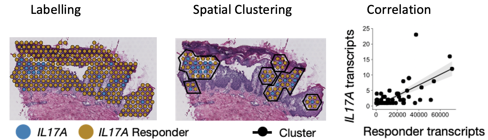

# Spatial transcriptomics landscape of non-communicable inflammatory skin diseases
Schäbitz A*, Hillig C*, Mubarak M, Jargosch M, Farnoud A, Scala E, Pilz AC, Bhalla N, Thomas J, Stahle M, 
Biedermann T, Schmidt-Weber CB, Theis F, Garzorz-Stark N, Eyerich K*, Menden MP*, Eyerich S*§ <br>

You can find the preprint version of the manuscript here: <br>
[Low numbers of cytokine transcripts drive inflammatory skin diseases by initiating amplification cascades in localized epidermal clusters](https://www.biorxiv.org/content/10.1101/2021.06.10.447894v1)


## Abstract
Abundant heterogeneous immune cells infiltrate chronic inflammatory diseases and characterization of these cells is 
needed to distinguish disease-driving from bystander immune cells. Here, we investigated the landscape of 
non-communicable inflammatory skin diseases (ncISD) by spatial transcriptomics resulting in a large repository 
of 62,000 spatially defined human cutaneous transcriptomes of 31 patients. <br>
Despite the expected immune cell infiltration, we observe rather low numbers of pathogenic disease driving cytokine 
transcripts (IFNG, IL13 and IL17A), i.e. >125 times less compared to the mean expression of all other genes over 
lesional skin sections. Nevertheless, cytokine expression is limited to lesional skin and presented in a 
disease-specific pattern. Leveraging a density-based spatial clustering method, we identify specific 
responder gene signatures in direct proximity of cytokines, and confirm that detected cytokine transcripts initiate 
amplification cascades up to thousands of specific responder transcripts forming localized epidermal clusters. 
Thus, within the abundant and heterogeneous infiltrates of ncISD, only a few cytokine transcripts drive disease by 
initiating an inflammatory amplification cascade in their local microenvironment. 

*key words*: Spatial transcriptomics, chronic inflammatory skin diseases, psoriasis, atopic dermatits, 
lichen planus, immune response, cytokines <br>


## Lets get started!
The source code used to generate the results and figures are in the py_scripts and r_scripts folder. 
Further, our *condition-based density clustering algorithm* can be found in the folder 
python_scripts/spatial_correlation. By running the **main.py** script you can either create figure 5F-H 
or read out information for the DGE analysis to create supplemental figure 8. <br> 
All preprocessing steps and analysis are run in python. Solely the differential gene expression (DGE) analysis and 
pathway enrichment analysis performed using R. <br> 
You can clone the repository by typing in the terminal the command: 
```{bash}
git clone https://github.com/Chillig/ST_biostatistical_analysis.git
```

### Dependencies
In order to run the preprocessing and analysis in python you will have to create a conda environment from the 
python_conda_env.yml. Before doing so, you will have to manually set the prefix variable in the python_conda_env.yml 
file to your directory. Now, you can run the following commands in the terminal:
```{bash}
# The following command will create an env with the name py37_sc_rpy2_diffxpy
conda env create -f https://raw.githubusercontent.com/Chillig/ST_biostatistical_analysis/main/envs/python_conda_env.yml
# Activate the conda env with
conda activate py37_sc_rpy2_diffxpy
```
For the DGE and pathway enrichment analysis the R version R 4.0.3 Patched (2020-10-23 r79366) is required. 
Additionally, the following cran and Bioconductor packages are needed: <br> 
```{r}
# cran packages
rlibs <- c("dplyr", "gtools", "hash", "kableExtra", "knitr", "stringr", "tibble", "xlsx")
invisible(lapply(rlibs, require, character.only = TRUE))
# Bioconductor packages (Bioconductor version 3.12 (BiocManager 1.30.12))
bioclibs <- c("glmGamPoi", "pathview",  "org.Hs.eg.db", "ReactomePA",  "enrichplot", "clusterProfiler")
invisible(lapply(bioclibs, require, character.only = TRUE))
```

### Preprocessing
Before the samples are analysed, they have been preprocessed by applying the standard procedures 
such as quality control (QC), filtering, normalisation and batch correction. 
You can find the scripts here: [Source code - Preprocessing](https://github.com/Chillig/ST_biostatistical_analysis/tree/main/python_scripts/pre_processing) <br>
The preprocessing is initiated by running [main_preprocessing.py](https://github.com/Chillig/ST_biostatistical_analysis/tree/main/python_scripts/pre_processing/main_preprocessing.py):
```{python}
/path/to/conda_dir/py37_sc_rpy2_diffxpy/bin/python /path/to/Publication_analysis/python_scripts/pre_processing/main_preprocessing.py
``` 

### Analysis
Figures generated with the source code can be recreated by running 
[main_analysis.py - Analysis](https://github.com/Chillig/ST_biostatistical_analysis/blob/main/python_scripts/analysis/main_analysis.py):
```{python}
/path/to/conda_dir/py37_sc_rpy2_diffxpy/bin/python /path/to/Publication_analysis/python_scripts/analysis/main_analysis.py
``` 

#### DGE analysis
In order to determine characteristic genes associated with cytokine-expressing leukocytes, 
a DGE analysis was performed between spots / cells containing cytokine-positive leukocytes and 
cytokine-negative leukocytes. A Vignette can be found here 
[Vignette - DGE Analysis](https://github.com/Chillig/ST_biostatistical_analysis/blob/main/r_scripts/dge_analysis/Vignette__DGE_Analysis.Rmd).
<br>

#### Pathway enrichment analysis
The output of the DGE analysis containing the gene names, p-values, and log2FC are used as input for 
this type of analysis. A Vignette can be found here 
[Vignette - Pathway Enrichment Analysis](https://github.com/Chillig/ST_biostatistical_analysis/blob/main/r_scripts/pathway_analysis/Vignette__Pathway_Enrichment_Analysis.Rmd).
<br>

#### Weighted correlation between cytokine and its signature responder genes
We investigated the functional relevance of the few cytokine transcripts in lesional ncISD skin by looking at the 
correlation between cytokine+ spots and their responder signatures in the epidermis. 
To do so we applied a density-based clustering customised for ST data and calculated the spatially weighted Spearman 
correlation between the UMI-counts of cytokines and the responder counts where the weights are the number of cytokine 
transcripts within a conditional density cluster.
 
<br>
[Source code - conditional spatial clustering and weighted correlation](https://github.com/Chillig/ST_biostatistical_analysis/tree/main/python_scripts/spatial_correlation) 
is provided.
The following command calls the function to redo the analysis shown in Figure 5F-H:
```{bash}
/path/to/conda_dir/py37_sc_rpy2_diffxpy/bin/python /path/to/Publication_analysis/python_scripts/spatial_correlation/main.py
```
<br>
<br>

## License
Reproduce the analysis for the manuscript "Low numbers of cytokine transcripts drive inflammatory skin diseases by 
initiating amplification cascades in localized epidermal clusters" Copyright (C) 2021 Christina Hillig, Ali Farnoud and Michael Menden.

This program is free software: you can redistribute it and/or modify
it under the terms of the GNU General Public License as published by
the Free Software Foundation, either version 3 of the License, or
(at your option) any later version.

This program is distributed in the hope that it will be useful,
but WITHOUT ANY WARRANTY; without even the implied warranty of
MERCHANTABILITY or FITNESS FOR A PARTICULAR PURPOSE.  See the
GNU General Public License for more details.

You should have received a copy of the GNU General Public License
along with this program.  If not, see <https://www.gnu.org/licenses/>.
